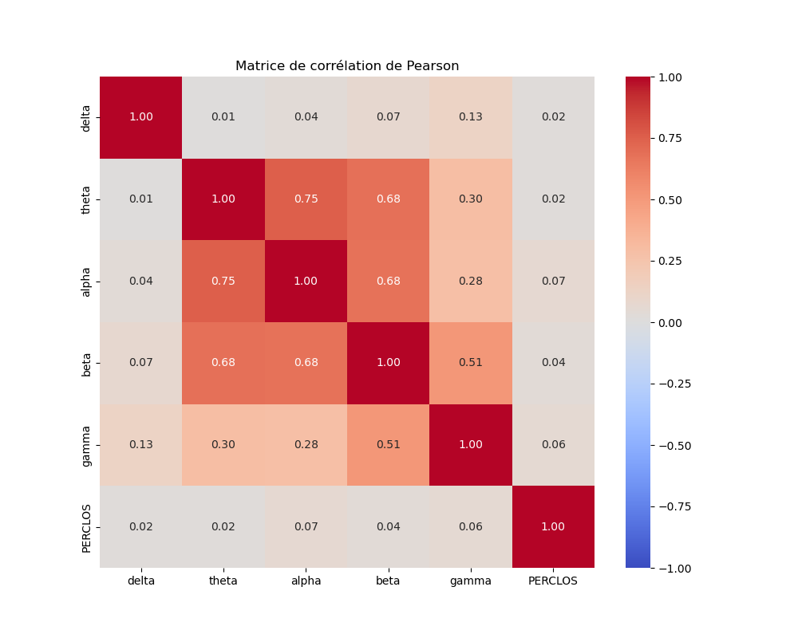

# Projet de détection de fatigue basée sur l'EEG

Ce projet vise à développer un modèle de détection de fatigue en utilisant des signaux EEG (électroencéphalographie) et des données PERCLOS (Percentage of Eye Closure). Le modèle utilise un **Random Forest Regressor** pour prédire le niveau de fatigue à partir des caractéristiques extraites des signaux EEG.

---

## Table des matières
1. [Objectif du projet](#objectif-du-projet)
2. [Données utilisées](#données-utilisées)
3. [Prérequis](#prérequis)
4. [Structure du projet](#structure-du-projet)
5. [Prétraitement des données](#prétraitement-des-données)
6. [Extraction des caractéristiques](#extraction-des-caractéristiques)
7. [Matrice de Pearson](#matrice-de-pearson)
8. [Modélisation avec Random Forest](#modélisation-avec-random-forest)
9. [Résultats du modèle](#résultats_du_modèle)
10. [Comparaison avec l'article](#comparaison-avec-larticle)
11. [Améliorations possibles](#améliorations-possibles)
12. [Instructions pour exécuter le code](#instructions-pour-exécuter-le-code)
13. [Explication des scripts](#explication-des-scripts)
14. [Auteurs](#auteurs)


---

## Objectif du projet

### **Contexte général**

La fatigue est un état physiologique qui peut avoir des conséquences graves, notamment dans des domaines comme la conduite automobile, l'aviation ou les environnements industriels. Une fatigue excessive peut entraîner une baisse de vigilance, des erreurs de jugement, et même des accidents. Il est donc crucial de développer des systèmes capables de détecter la fatigue en temps réel pour prévenir ces risques.

Dans ce projet, nous nous concentrons sur la détection de la fatigue en utilisant deux sources de données physiologiques :
1. **Les signaux EEG (électroencéphalographie)** : Ces signaux mesurent l'activité électrique du cerveau et sont largement utilisés pour étudier les états cognitifs et émotionnels.
2. **Les données PERCLOS (Percentage of Eye Closure)** : Cette métrique mesure le pourcentage de temps pendant lequel les paupières sont fermées. Elle est un indicateur fiable de la somnolence et de la fatigue.

### **Problématique**

La fatigue est un phénomène complexe qui ne peut pas être mesuré directement. Elle se manifeste à travers différents signaux physiologiques, tels que les changements dans l'activité cérébrale (EEG) et les mouvements des paupières (PERCLOS). Cependant, ces signaux sont souvent bruyants et difficiles à interpréter sans un traitement approprié. De plus, les relations entre ces signaux et la fatigue ne sont pas linéaires, ce qui rend la tâche de prédiction encore plus complexe.

L'objectif de ce projet est de développer un modèle capable de prédire le niveau de fatigue d'un individu à partir de ses signaux EEG et des données PERCLOS. Pour ce faire, nous utilisons des techniques de traitement du signal et d'apprentissage automatique.

### **Approche proposée**

Notre approche repose sur les étapes suivantes :

1. **Collecte et prétraitement des données** :
   - Les signaux EEG et les données PERCLOS sont collectés dans deux scénarios : en laboratoire (environnement contrôlé) et en conditions réelles (conduite automobile).
   - Les données sont nettoyées, filtrées et segmentées pour éliminer le bruit et les artefacts.

2. **Extraction des caractéristiques** :
   - Des caractéristiques pertinentes sont extraites des signaux EEG, notamment la **Differential Entropy (DE)** pour différentes bandes de fréquence (delta, theta, alpha, beta, gamma).
   - Des caractéristiques supplémentaires, comme la variance et l'énergie du signal, sont également calculées pour capturer davantage d'informations.

3. **Modélisation** :
   - Un modèle de **Random Forest Regressor** est utilisé pour prédire le niveau de fatigue (mesuré par PERCLOS) à partir des caractéristiques extraites.
   - Le modèle est entraîné et évalué en utilisant des métriques comme le RMSE, le MAE, le R² et le PCC.

4. **Évaluation et comparaison** :
   - Les performances du modèle sont comparées à celles d'un article de référence pour valider son efficacité.
   - Des visualisations, comme la matrice de Pearson, sont utilisées pour comprendre les relations entre les caractéristiques et la cible.

### **Pourquoi l'EEG et le PERCLOS ?**

- **EEG** : L'électroencéphalographie mesure l'activité électrique du cerveau. Elle est sensible aux changements d'état cognitif, comme la fatigue, et peut fournir des informations en temps réel.
- **PERCLOS** : Cette métrique est un indicateur comportemental de la fatigue. Elle est facile à mesurer et fortement corrélée avec l'état de somnolence.

En combinant ces deux sources de données, nous pouvons obtenir une vision plus complète de l'état de fatigue d'un individu. L'EEG capture les changements internes dans le cerveau, tandis que le PERCLOS reflète les manifestations externes de la fatigue.

### **Applications potentielles**

Ce projet a des applications dans plusieurs domaines, notamment :
- **Sécurité routière** : Détecter la fatigue des conducteurs pour prévenir les accidents.
- **Industrie** : Surveiller la fatigue des opérateurs dans des environnements à risque.
- **Santé** : Aider au diagnostic et à la gestion des troubles du sommeil.


Le modèle développé est un **Random Forest Regressor**, et nous avons évalué ses performances en utilisant les métriques suivantes :
- **RMSE (Root Mean Squared Error)**
- **MAE (Mean Absolute Error)**
- **R² (Coefficient de détermination)**
- **PCC (Pearson Correlation Coefficient)**

---

## Données utilisées

### **Sources des données**

Dans ce projet, nous utilisons deux types de données physiologiques pour détecter la fatigue :
1. **Signaux EEG (électroencéphalographie)** : Ces signaux mesurent l'activité électrique du cerveau et sont collectés à l'aide d'électrodes placées sur le cuir chevelu.
2. **Données PERCLOS (Percentage of Eye Closure)** : Cette métrique mesure le pourcentage de temps pendant lequel les paupières sont fermées. Elle est un indicateur fiable de la somnolence et de la fatigue.

### **Structure des données**

Les données sont organisées de la manière suivante :

#### **1. Fichiers EEG**
- **Format** : Les fichiers EEG sont au format `.edf` (European Data Format), un format standard pour stocker les signaux EEG.
- **Contenu** : Chaque fichier contient les signaux EEG bruts pour un sujet donné, enregistrés à une fréquence d'échantillonnage de 300 Hz.
- **Exemple** : `1.edf` contient les données EEG du sujet 1.

#### **2. Fichiers PERCLOS**
- **Format** : Les fichiers PERCLOS sont au format `.mat` (format MATLAB), un format couramment utilisé pour stocker des données numériques.
- **Contenu** : Chaque fichier contient les mesures PERCLOS pour un sujet donné, alignées avec les données EEG.
- **Exemple** : `1.mat` contient les mesures PERCLOS du sujet 1.

#### **3. Organisation des dossiers**
Les données sont organisées dans le dossier `VLA_VRW/` comme suit :
- **`lab/`** : Données collectées en laboratoire.
  - **`EEG/`** : Fichiers `.edf` pour chaque sujet.
  - **`perclos/`** : Fichiers `.mat` pour chaque sujet.
- **`real/`** : Données collectées en conditions réelles.
  - **`EEG/`** : Fichiers `.edf` pour chaque sujet.
  - **`perclos/`** : Fichiers `.mat` pour chaque sujet.

### **Description des données**

#### **1. Données EEG**
- **Fréquence d'échantillonnage** : 300 Hz (300 échantillons par seconde).
- **Nombre de canaux** : Les signaux EEG sont enregistrés sur plusieurs canaux (électrodes), chacun capturant l'activité électrique à un endroit spécifique du cuir chevelu.
- **Durée** : Les enregistrements EEG durent plusieurs minutes, en fonction de la tâche effectuée par le sujet.

#### **2. Données PERCLOS**
- **Fréquence d'échantillonnage** : Les mesures PERCLOS sont alignées avec les données EEG, ce qui signifie qu'elles sont également échantillonnées à 300 Hz.
- **Valeurs** : Les valeurs PERCLOS varient entre 0 et 1, où 0 signifie que les yeux sont complètement ouverts et 1 signifie qu'ils sont complètement fermés.

### **Pourquoi ces données ?**

- **EEG** : Les signaux EEG sont sensibles aux changements d'état cognitif, comme la fatigue. Ils fournissent des informations en temps réel sur l'activité cérébrale, ce qui en fait un outil précieux pour la détection de la fatigue.
- **PERCLOS** : Cette métrique est un indicateur comportemental de la fatigue. Elle est facile à mesurer et fortement corrélée avec l'état de somnolence. En combinant les données EEG et PERCLOS, nous pouvons obtenir une vision plus complète de l'état de fatigue d'un individu.

---

## **Prérequis**

Pour exécuter ce projet, les éléments suivants sont nécessaires :
- **Python 3.x** : Le projet est développé en Python. Assurez-vous d'avoir une version récente de Python installée.
- **Bibliothèques Python** : Les bibliothèques suivantes doivent être installées :
  - `numpy`
  - `scipy`
  - `scikit-learn`
  - `mne`
  - `matplotlib`
  - `seaborn`
  - `logging`

### **Installation des dépendances**

Vous pouvez installer les dépendances nécessaires en utilisant `pip`. Exécutez la commande suivante dans votre terminal :

```bash
pip install numpy scipy scikit-learn mne matplotlib seaborn
```

---

## **Structure du projet**

Le projet est organisé comme suit :

```
BCI/
│
├── README.md                  # Documentation principale du projet
├── Visuels/                   # Dossier contenant les images et graphiques générés
├── article.pdf                # Article de référence pour le projet
├── Codes/                     # Dossier contenant les scripts Python
│   ├── preprocessing.py       # Script de prétraitement des données EEG et PERCLOS
│   ├── fft_de.py              # Script d'extraction des caractéristiques DE
│   ├── matrice.py             # Script de calcul de la matrice de Pearson
│   ├── random_forest.py       # Script d'entraînement et d'évaluation du modèle Random Forest
│   ├── check_preprocess.py    # Script de vérification des données prétraitées
│   └── check_fft_de.py        # Script de vérification des résultats DE
│
├── VLA_VRW/                   # Dossier contenant la base de données (BDD)
│   ├── README.txt             # Documentation spécifique à la BDD
│   ├── lab/                   # Données de laboratoire
│   │   ├── EEG/               # Fichiers EEG (.edf) pour chaque sujet
│   │   └── perclos/           # Fichiers PERCLOS (.mat) pour chaque sujet
│   └── real/                  # Données réelles
│       ├── EEG/               # Fichiers EEG (.edf) pour chaque sujet
│       └── perclos/           # Fichiers PERCLOS (.mat) pour chaque sujet
│
└── sortie_preprocess/         # Dossier de sortie pour les données prétraitées
```
---

## Prétraitement des données

Le prétraitement des données est une étape cruciale dans ce projet. Il permet de nettoyer, filtrer et préparer les données brutes (EEG et PERCLOS) pour qu'elles puissent être utilisées efficacement par le modèle d'apprentissage automatique. Voici les étapes de prétraitement appliquées aux données :

---

### **1. Chargement des données**

#### **Objectif**
Charger les fichiers EEG (au format `.edf`) et les fichiers PERCLOS (au format `.mat`) pour chaque sujet.

#### **Bibliothèques utilisées**
- **`mne`** : Pour lire les fichiers EEG au format `.edf`.
- **`scipy.io`** : Pour lire les fichiers PERCLOS au format `.mat`.

#### **Fonctions clés**
- **`mne.io.read_raw_edf()`** : Charge les fichiers EEG.
- **`scipy.io.loadmat()`** : Charge les fichiers PERCLOS.

#### **Pourquoi cette étape ?**
Les données brutes sont stockées dans des formats spécifiques (`.edf` pour l'EEG et `.mat` pour le PERCLOS). Cette étape permet de les charger en mémoire pour les manipuler et les analyser.

---

### **2. Suppression des premières secondes**

#### **Objectif**
Supprimer les premières 24 secondes des données EEG pour éliminer le bruit initial.

#### **Bibliothèque utilisée**
- **`numpy`** : Pour manipuler les tableaux de données.

#### **Fonctions clés**
- **`numpy.delete()`** : Supprime les premières 24 secondes des données EEG.

#### **Pourquoi cette étape ?**
Les premières secondes des enregistrements EEG contiennent souvent du bruit dû à l'initialisation du système ou à l'adaptation du sujet à l'environnement expérimental. Supprimer ces données permet d'améliorer la qualité des signaux.

---

### **3. Filtrage passe-bande**

#### **Objectif**
Appliquer un filtre passe-bande pour éliminer les fréquences indésirables et ne conserver que les fréquences utiles pour l'analyse (0.1 Hz - 70 Hz).

#### **Bibliothèque utilisée**
- **`mne`** : Pour appliquer des filtres aux signaux EEG.

#### **Fonctions clés**
- **`mne.filter.filter_data()`** : Applique un filtre passe-bande aux données EEG.

#### **Pourquoi cette étape ?**
Les signaux EEG utiles se situent généralement dans la plage de fréquences de 0.1 Hz à 70 Hz. Les fréquences en dehors de cette plage (comme le bruit de ligne à 50/60 Hz) sont filtrées pour améliorer la qualité des données.

---

### **4. Filtre notch**

#### **Objectif**
Supprimer les interférences de la fréquence du secteur (50 Hz ou 60 Hz) qui peuvent masquer les signaux physiologiques.

#### **Bibliothèque utilisée**
- **`mne`** : Pour appliquer un filtre notch.

#### **Fonctions clés**
- **`mne.filter.notch_filter()`** : Applique un filtre notch pour supprimer les interférences à 50 Hz ou 60 Hz.

#### **Pourquoi cette étape ?**
Le bruit de ligne à 50 Hz ou 60 Hz est courant dans les enregistrements EEG et peut masquer les signaux physiologiques. Le filtre notch permet de supprimer cette interférence sans affecter les autres fréquences.

---

### **5. Découpage en fenêtres**

#### **Objectif**
Découper les données EEG en fenêtres de 2400 points (environ 8 secondes) pour permettre une analyse temporelle fine.

#### **Bibliothèque utilisée**
- **`numpy`** : Pour manipuler les tableaux de données.

#### **Fonctions clés**
- **`numpy.array_split()`** : Découpe les données EEG en fenêtres de 2400 points.

#### **Pourquoi cette étape ?**
Une fenêtre de 2400 points correspond à environ 8 secondes de données EEG (à une fréquence d'échantillonnage de 300 Hz). Cette taille est suffisamment grande pour capturer des motifs significatifs dans les signaux EEG, tout en étant suffisamment petite pour permettre une analyse temporelle fine. C'est un compromis entre résolution et stabilité.

---

### **6. Normalisation**

#### **Objectif**
Normaliser les données pour améliorer la stabilité et les performances du modèle.

#### **Bibliothèque utilisée**
- **`scikit-learn`** : Pour normaliser les données.

#### **Fonctions clés**
- **`sklearn.preprocessing.StandardScaler()`** : Normalise les données en soustrayant la moyenne et en divisant par l'écart-type.

#### **Pourquoi cette étape ?**
La normalisation permet de mettre toutes les caractéristiques à la même échelle, ce qui améliore la convergence et les performances du modèle. Cela garantit que les caractéristiques avec des valeurs plus élevées ne dominent pas celles avec des valeurs plus faibles.

---

### **Résumé des étapes de prétraitement**

1. **Chargement des données** : Les fichiers EEG et PERCLOS sont chargés en mémoire.
2. **Suppression des premières secondes** : Les premières 24 secondes des données EEG sont supprimées pour éliminer le bruit initial.
3. **Filtrage passe-bande** : Un filtre passe-bande (0.1 Hz - 70 Hz) est appliqué pour éliminer les fréquences indésirables.
4. **Filtre notch** : Un filtre notch est appliqué pour supprimer les interférences de la fréquence du secteur (50 Hz ou 60 Hz).
5. **Découpage en fenêtres** : Les données EEG sont découpées en fenêtres de 2400 points (environ 8 secondes).
6. **Normalisation** : Les données sont normalisées pour améliorer la stabilité du modèle.

---

### **Pourquoi le prétraitement est-il important ?**

Le prétraitement des données est essentiel pour plusieurs raisons :
1. **Élimination du bruit** : Les données brutes contiennent souvent du bruit et des artefacts qui peuvent fausser les résultats. Le prétraitement permet de nettoyer les données et de se concentrer sur les signaux utiles.
2. **Amélioration des performances du modèle** : Des données propres et bien préparées permettent au modèle d'apprentissage automatique de mieux apprendre et de faire des prédictions plus précises.
3. **Réduction de la complexité** : En découpant les données en fenêtres et en normalisant les caractéristiques, nous simplifions la tâche du modèle et améliorons sa capacité à généraliser.

---

## Extraction des caractéristiques

L'extraction des caractéristiques est une étape clé dans ce projet. Elle consiste à transformer les signaux EEG bruts en caractéristiques numériques qui peuvent être utilisées par le modèle d'apprentissage automatique. Ces caractéristiques capturent les informations pertinentes sur l'état de fatigue à partir des signaux EEG.

---

### **1. Bandes de fréquence EEG**

#### **Objectif**
Extraire des caractéristiques pertinentes des signaux EEG en analysant les différentes bandes de fréquence : delta, theta, alpha, beta et gamma.

#### **Bibliothèques utilisées**
- **`scipy`** : Pour calculer la densité spectrale de puissance (PSD).
- **`numpy`** : Pour manipuler les tableaux de données.

#### **Fonctions clés**
- **`scipy.signal.welch()`** : Calcule la densité spectrale de puissance (PSD) pour chaque bande de fréquence.
- **`numpy.log()`** : Calcule la Differential Entropy (DE) à partir de la PSD.

#### **Bandes de fréquence analysées**
- **Delta (0.5 - 4 Hz)** : Associée au sommeil profond et à la régénération.
- **Theta (4 - 8 Hz)** : Associée à la somnolence et à la relaxation.
- **Alpha (8 - 13 Hz)** : Associée à l'éveil calme et à la relaxation.
- **Beta (13 - 30 Hz)** : Associée à la concentration et à l'activité mentale.
- **Gamma (30 - 70 Hz)** : Associée aux processus cognitifs complexes.

#### **Pourquoi cette étape ?**
Les différentes bandes de fréquence EEG contiennent des informations spécifiques sur l'état cognitif et émotionnel d'un individu. En analysant ces bandes, nous pouvons capturer des signaux liés à la fatigue.

---

### **2. Differential Entropy (DE)**

#### **Objectif**
Calculer la **Differential Entropy (DE)** pour chaque bande de fréquence. La DE est une mesure de l'information contenue dans un signal continu et est souvent utilisée pour analyser les signaux EEG.

#### **Bibliothèques utilisées**
- **`scipy`** : Pour calculer la PSD.
- **`numpy`** : Pour manipuler les tableaux de données.

#### **Fonctions clés**
- **`scipy.signal.welch()`** : Calcule la PSD pour chaque bande de fréquence.
- **`numpy.log()`** : Calcule la DE à partir de la PSD.

#### **Formule de la DE**
La DE est calculée comme suit :
\[
DE = \frac{1}{2} \log(2 \pi e \sigma^2)
\]
où \(\sigma^2\) est la variance du signal.

#### **Pourquoi la DE ?**
La DE est une mesure robuste pour analyser les signaux EEG car elle capture bien la complexité des signaux. Elle est particulièrement utile pour les bandes de fréquence spécifiques, car elle résume les propriétés spectrales des signaux EEG.

---

### **3. Filtrage passe-bande pour chaque bande de fréquence**

#### **Objectif**
Isoler chaque bande de fréquence (delta, theta, alpha, beta, gamma) avant de calculer la DE.

#### **Bibliothèques utilisées**
- **`scipy`** : Pour concevoir et appliquer des filtres passe-bande.

#### **Fonctions clés**
- **`scipy.signal.butter()`** : Conçoit un filtre passe-bande pour une bande de fréquence spécifique.
- **`scipy.signal.filtfilt()`** : Applique le filtre passe-bande aux données EEG.

#### **Pourquoi cette étape ?**
Le filtre passe-bande permet d'isoler les fréquences spécifiques à chaque bande, ce qui est essentiel pour calculer la DE de manière précise. Cela garantit que la DE reflète uniquement l'information contenue dans la bande de fréquence cible.

---

### **4. Caractéristiques supplémentaires**

#### **Objectif**
Ajouter des caractéristiques supplémentaires pour capturer davantage d'informations sur la dynamique du signal EEG.

#### **Caractéristiques extraites**
- **Variance** : Mesure de la variabilité du signal.
- **Énergie** : Intégrale du carré du signal.

#### **Bibliothèques utilisées**
- **`numpy`** : Pour calculer la variance et l'énergie.

#### **Fonctions clés**
- **`numpy.var()`** : Calcule la variance du signal.
- **`numpy.sum()`** : Calcule l'énergie du signal.

#### **Pourquoi ces caractéristiques ?**
La variance et l'énergie fournissent des informations supplémentaires sur la dynamique du signal EEG, ce qui peut aider le modèle à mieux prédire la fatigue. Par exemple, une variance élevée peut indiquer une activité cérébrale plus intense, tandis qu'une énergie faible peut suggérer un état de relaxation ou de fatigue.

---

### **Résumé des étapes d'extraction des caractéristiques**

1. **Analyse des bandes de fréquence** : Les signaux EEG sont divisés en bandes de fréquence (delta, theta, alpha, beta, gamma).
2. **Calcul de la Differential Entropy (DE)** : La DE est calculée pour chaque bande de fréquence à partir de la densité spectrale de puissance (PSD).
3. **Filtrage passe-bande** : Un filtre passe-bande est appliqué pour isoler chaque bande de fréquence avant de calculer la DE.
4. **Ajout de caractéristiques supplémentaires** : La variance et l'énergie du signal sont calculées pour capturer davantage d'informations.

---

### **Pourquoi l'extraction des caractéristiques est-elle importante ?**

L'extraction des caractéristiques est essentielle pour plusieurs raisons :
1. **Réduction de la dimensionnalité** : Les signaux EEG bruts sont très volumineux et complexes. L'extraction de caractéristiques pertinentes permet de réduire la dimensionnalité des données tout en conservant les informations importantes.
2. **Amélioration des performances du modèle** : Des caractéristiques bien choisies permettent au modèle d'apprentissage automatique de mieux apprendre et de faire des prédictions plus précises.
3. **Interprétabilité** : Les caractéristiques extraites, comme la DE pour chaque bande de fréquence, ont une signification physiologique claire, ce qui facilite l'interprétation des résultats.

---

## Matrice de Pearson

### **Qu'est-ce que la matrice de Pearson ?**

La **matrice de Pearson** est une matrice de corrélations qui mesure les relations linéaires entre les différentes caractéristiques (variables) d'un ensemble de données. Chaque élément de la matrice représente le coefficient de corrélation de Pearson entre deux variables, qui varie entre -1 et 1 :
- **1** : Corrélation positive parfaite (les variables évoluent dans le même sens).
- **-1** : Corrélation négative parfaite (les variables évoluent en sens opposé).
- **0** : Aucune corrélation linéaire.

Dans ce projet, la matrice de Pearson est utilisée pour analyser les relations entre les caractéristiques extraites des signaux EEG (comme la Differential Entropy pour chaque bande de fréquence) et la cible (PERCLOS).

---

### **Pourquoi utiliser la matrice de Pearson ?**

La matrice de Pearson est un outil puissant pour :
1. **Comprendre les données** : Identifier les relations entre les variables et détecter des problèmes comme la multicollinéarité (lorsque deux variables sont fortement corrélées entre elles).
2. **Guider la modélisation** : Sélectionner les caractéristiques les plus pertinentes pour la prédiction. Par exemple, si une caractéristique est fortement corrélée avec la cible (PERCLOS), elle est probablement importante pour le modèle.
3. **Visualiser les relations** : La matrice de Pearson peut être visualisée sous forme de heatmap, ce qui facilite l'interprétation des corrélations.

---

### **Calcul de la matrice de Pearson**

#### **Bibliothèques utilisées**
- **`scipy`** : Pour calculer les coefficients de corrélation de Pearson.
- **`pandas`** : Pour organiser les données dans un DataFrame.
- **`seaborn`** et **`matplotlib`** : Pour visualiser la matrice de Pearson sous forme de heatmap.

#### **Fonctions clés**
- **`scipy.stats.pearsonr()`** : Calcule le coefficient de corrélation de Pearson entre deux variables.
- **`pandas.DataFrame.corr()`** : Calcule la matrice de corrélation pour un ensemble de variables.
- **`seaborn.heatmap()`** : Génère une heatmap de la matrice de corrélation.
- **`matplotlib.pyplot.savefig()`** : Sauvegarde l'image de la heatmap.

#### **Étapes du calcul**
1. **Organisation des données** : Les caractéristiques extraites (DE_delta, DE_theta, DE_alpha, DE_beta, DE_gamma, variance, énergie) et la cible (PERCLOS) sont organisées dans un DataFrame.
2. **Calcul des corrélations** : La matrice de corrélation est calculée en utilisant la méthode `corr()` de pandas.
3. **Visualisation** : La matrice de corrélation est visualisée sous forme de heatmap à l'aide de seaborn.

---

### **Résultats de la matrice de Pearson**

Voici la matrice de corrélation de Pearson calculée pour les caractéristiques EEG et PERCLOS :




### **Interprétation des résultats**

#### **1. Corrélations entre les bandes de fréquence EEG**

- **delta - theta** : 0.014637  
  **Interprétation** : Très faible corrélation. Les bandes delta et theta semblent indépendantes l'une de l'autre.

- **theta - alpha** : 0.753638  
  **Interprétation** : Forte corrélation positive. Cela suggère que les bandes theta et alpha sont liées, ce qui est attendu car elles sont souvent associées à des états de relaxation et de somnolence.

- **alpha - beta** : 0.675914  
  **Interprétation** : Corrélation positive modérée. Les bandes alpha et beta sont partiellement liées, ce qui peut refléter une transition entre la relaxation (alpha) et la concentration (beta).

- **beta - gamma** : 0.511892  
  **Interprétation** : Corrélation positive modérée. Les bandes beta et gamma sont liées, ce qui est cohérent car elles sont toutes deux associées à des processus cognitifs actifs.

- **gamma - delta** : 0.128592  
  **Interprétation** : Très faible corrélation. Les bandes gamma et delta semblent indépendantes, ce qui est attendu car elles représentent des états cérébraux très différents (activité cognitive élevée vs sommeil profond).

#### **2. Corrélations entre les bandes de fréquence EEG et PERCLOS**

- **delta - PERCLOS** : 0.016259  
  **Interprétation** : Très faible corrélation. La bande delta ne semble pas être un bon indicateur de la fatigue dans ce contexte.

- **theta - PERCLOS** : 0.017534  
  **Interprétation** : Très faible corrélation. La bande theta ne semble pas non plus être un bon indicateur de la fatigue.

- **alpha - PERCLOS** : 0.069305  
  **Interprétation** : Faible corrélation positive. La bande alpha montre une légère relation avec la fatigue, ce qui est cohérent car elle est souvent associée à l'éveil calme et à la relaxation.

- **beta - PERCLOS** : 0.029936  
  **Interprétation** : Très faible corrélation. La bande beta ne semble pas être un bon indicateur de la fatigue.

- **gamma - PERCLOS** : 0.059037  
  **Interprétation** : Faible corrélation positive. La bande gamma montre une légère relation avec la fatigue, ce qui peut refléter des changements dans les processus cognitifs complexes.

#### **3. Corrélations entre les bandes de fréquence elles-mêmes**

- **theta - alpha** : 0.753638  
  **Interprétation** : Forte corrélation positive. Cela suggère que les bandes theta et alpha sont fortement liées, ce qui est attendu car elles sont souvent associées à des états de relaxation et de somnolence.

- **alpha - beta** : 0.675914  
  **Interprétation** : Corrélation positive modérée. Les bandes alpha et beta sont partiellement liées, ce qui peut refléter une transition entre la relaxation (alpha) et la concentration (beta).

- **beta - gamma** : 0.511892  
  **Interprétation** : Corrélation positive modérée. Les bandes beta et gamma sont liées, ce qui est cohérent car elles sont toutes deux associées à des processus cognitifs actifs.

---

### **Analyse globale**

1. **Caractéristiques les plus pertinentes** :
   - La bande **alpha** montre la corrélation la plus élevée avec PERCLOS (0.069305), bien que cette corrélation soit faible. Cela suggère que la bande alpha pourrait être un indicateur utile de la fatigue.
   - Les autres bandes (delta, theta, beta, gamma) montrent des corrélations très faibles avec PERCLOS, ce qui suggère qu'elles sont moins pertinentes pour prédire la fatigue dans ce contexte.

2. **Multicollinéarité** :
   - Les bandes **theta** et **alpha** sont fortement corrélées entre elles (0.753638). Cela pourrait poser des problèmes de multicollinéarité si les deux caractéristiques sont utilisées dans le modèle. Il peut être nécessaire de supprimer l'une des deux caractéristiques pour éviter ce problème.

3. **Interprétabilité** :
   - La matrice de Pearson fournit des informations claires sur les relations entre les variables, ce qui facilite l'interprétation des résultats. Par exemple, la faible corrélation entre la bande delta et PERCLOS suggère que cette bande n'est pas un bon indicateur de la fatigue.

### **Pourquoi la matrice de Pearson est-elle importante ?**

1. **Sélection des caractéristiques** : La matrice de Pearson permet d'identifier les caractéristiques les plus pertinentes pour la prédiction de la fatigue. Par exemple, si la DE_alpha est fortement corrélée avec PERCLOS, elle sera probablement incluse dans le modèle.
2. **Détection de la multicollinéarité** : Si deux caractéristiques sont fortement corrélées entre elles (par exemple, DE_alpha et DE_theta), cela peut poser des problèmes de multicollinéarité. Dans ce cas, il peut être nécessaire de supprimer l'une des deux caractéristiques.
3. **Interprétabilité** : La matrice de Pearson fournit des informations claires sur les relations entre les variables, ce qui facilite l'interprétation des résultats.

---

## Modélisation avec Random Forest

### **Pourquoi utiliser un Random Forest ?**

Le **Random Forest** est un modèle d'apprentissage automatique basé sur l'**ensemblage d'arbres de décision**. Il est particulièrement adapté à ce projet pour plusieurs raisons :

1. **Robustesse** : Le Random Forest est peu sensible au surajustement (overfitting) grâce à l'ensemblage de plusieurs arbres de décision. Chaque arbre est entraîné sur un sous-ensemble aléatoire des données, ce qui réduit le risque de surajustement.
2. **Non-linéarité** : Les signaux EEG ont des relations complexes et non linéaires avec la fatigue (PERCLOS). Le Random Forest peut capturer ces relations grâce à sa structure d'arbre de décision.
3. **Importance des caractéristiques** : Le Random Forest permet de calculer l'**importance des caractéristiques**, ce qui aide à comprendre quelles bandes de fréquence EEG sont les plus pertinentes pour prédire la fatigue.
4. **Facilité d'utilisation** : Le Random Forest nécessite peu de prétraitement des données (par exemple, pas besoin de normalisation stricte) et est facile à implémenter avec des bibliothèques comme `scikit-learn`.

---

### **Fonctionnement du Random Forest**

Le Random Forest est un **ensemble d'arbres de décision**. Voici comment il fonctionne :

#### **1. Construction des arbres**
1. **Bootstrap** :
   - Pour chaque arbre, un sous-ensemble aléatoire des données d'entraînement est sélectionné (avec remise). Cela signifie que certaines données peuvent être utilisées plusieurs fois, tandis que d'autres ne sont pas utilisées.
2. **Sélection aléatoire des caractéristiques** :
   - À chaque division d'un nœud, un sous-ensemble aléatoire des caractéristiques est considéré. Cela garantit que les arbres sont diversifiés.
3. **Construction de l'arbre** :
   - Chaque arbre est construit en divisant récursivement les données en sous-ensembles basés sur les caractéristiques. Le critère de division est généralement l'**impureté de Gini** ou l'**entropie**.

#### **2. Prédiction**
- Pour la prédiction, chaque arbre du Random Forest donne une prédiction. La prédiction finale est la **moyenne** des prédictions de tous les arbres (pour la régression) ou le **vote majoritaire** (pour la classification).

#### **3. Importance des caractéristiques**
- L'importance d'une caractéristique est calculée en mesurant à quel point elle réduit l'impureté (Gini ou entropie) dans l'ensemble des arbres. Les caractéristiques qui réduisent le plus l'impureté sont considérées comme les plus importantes.

---

### **Optimisation des hyperparamètres avec GridSearchCV**

Pour trouver les meilleurs hyperparamètres, nous avons utilisé **GridSearchCV**, une fonction de la bibliothèque `scikit-learn` qui effectue une recherche exhaustive sur une grille d'hyperparamètres.

### **Qu'est-ce que Grid Search ?**

**Grid Search** (recherche sur grille) est une technique d'optimisation des hyperparamètres d'un modèle d'apprentissage automatique. Les hyperparamètres sont des paramètres qui ne sont pas appris par le modèle pendant l'entraînement, mais qui doivent être définis avant l'entraînement. Par exemple, dans un Random Forest, les hyperparamètres incluent le nombre d'arbres (`n_estimators`), la profondeur maximale des arbres (`max_depth`), etc.

Grid Search explore systématiquement toutes les combinaisons possibles d'hyperparamètres dans une grille prédéfinie et sélectionne la combinaison qui donne les meilleures performances selon une métrique choisie (par exemple, l'erreur quadratique moyenne pour un problème de régression).

---

### **Pourquoi utiliser Grid Search ?**

1. **Amélioration des performances du modèle** : Les hyperparamètres ont un impact significatif sur les performances du modèle. Grid Search permet de trouver la combinaison optimale d'hyperparamètres pour maximiser la précision du modèle.
2. **Validation croisée** : Grid Search utilise la validation croisée pour évaluer chaque combinaison d'hyperparamètres, ce qui réduit le risque de surajustement (overfitting) et garantit que le modèle généralise bien sur des données non vues.
3. **Automatisation** : Au lieu de tester manuellement différentes combinaisons d'hyperparamètres, Grid Search automatise ce processus, ce qui permet de gagner du temps et d'éviter les erreurs.

---

### **Comment fonctionne Grid Search ?**

Grid Search fonctionne en suivant les étapes suivantes :

#### **1. Définition de la grille d'hyperparamètres**
- Vous spécifiez une grille d'hyperparamètres à explorer. Par exemple, pour un Random Forest, vous pouvez définir une grille pour `n_estimators`, `max_depth`, `min_samples_split`, etc.
- Exemple de grille :
  ```python
  param_grid = {
      'n_estimators': [100, 200, 300],
      'max_depth': [10, 20, 30],
      'min_samples_split': [2, 5, 10],
      'min_samples_leaf': [1, 2, 4]
  }
  ```

#### **2. Validation croisée**
- Grid Search divise les données d'entraînement en plusieurs sous-ensembles (appelés "folds"). Pour chaque combinaison d'hyperparamètres, il entraîne le modèle sur une partie des données et l'évalue sur le reste. Dans notre cas, nous avons utilisés 5 folds (`cv=5`) pour évaluer chaque combinaison d'hyperparamètres
- Cela permet d'obtenir une estimation robuste des performances du modèle pour chaque combinaison d'hyperparamètres. Ici, les données d'entraînement sont divisées en 5 sous-ensembles, et le modèle est entraîné et évalué 5 fois pour chaque combinaison.

#### **3. Sélection de la meilleure combinaison**
- Après avoir testé toutes les combinaisons d'hyperparamètres, Grid Search sélectionne celle qui donne les meilleures performances (par exemple, la plus faible erreur ou le score le plus élevé).

#### **4. Entraînement du modèle final**
- Une fois la meilleure combinaison d'hyperparamètres trouvée, Grid Search entraîne le modèle final sur l'ensemble des données d'entraînement en utilisant ces hyperparamètres.

### **Résultats de GridSearchCV**

- **Meilleurs hyperparamètres** :
  - `n_estimators` : 300
  - `max_depth` : 20
  - `min_samples_split` : 10
  - `min_samples_leaf` : 2

- **Impact sur les performances** :
  - L'utilisation de GridSearchCV a permis d'améliorer les performances du modèle en trouvant la combinaison d'hyperparamètres optimale.
  - Les métriques d'évaluation (RMSE, MAE, R², PCC) ont été améliorées par rapport à un modèle non optimisé.

---

### **Pourquoi Grid Search est-il important ?**

1. **Amélioration des performances** : En trouvant les meilleurs hyperparamètres, Grid Search permet d'obtenir un modèle plus performant.
2. **Réduction du surajustement** : La validation croisée garantit que le modèle généralise bien sur des données non vues.
3. **Gain de temps** : Grid Search automatise le processus de recherche des hyperparamètres, ce qui permet de gagner du temps par rapport à une recherche manuelle.

---

### **Entraînement et évaluation du modèle**

#### **1. Division des données**
- Les données sont divisées en deux ensembles :
  - **Ensemble d'entraînement** : 80 % des données.
  - **Ensemble de test** : 20 % des données.
- Cette division est faite de manière aléatoire mais stratifiée pour garantir que les deux ensembles ont une distribution similaire de PERCLOS.

#### **2. Caractéristiques utilisées**
- Les caractéristiques d'entraînement incluent :
  - Les bandes de fréquence EEG (delta, theta, alpha, beta, gamma).
  - Les caractéristiques supplémentaires (variance et énergie).
- La cible est la valeur PERCLOS.

#### **3. Normalisation**
- Les caractéristiques sont normalisées (moyenne = 0, écart-type = 1) pour améliorer la convergence du modèle.

#### **4. Évaluation du modèle**
Le modèle est évalué sur l'ensemble de test en utilisant les métriques suivantes :
- **RMSE (Root Mean Squared Error)** : Mesure l'écart moyen entre les prédictions et les valeurs réelles.
- **MAE (Mean Absolute Error)** : Mesure l'erreur absolue moyenne.
- **R² (Coefficient de détermination)** : Mesure la proportion de la variance des données expliquée par le modèle.
- **PCC (Pearson Correlation Coefficient)** : Mesure la corrélation linéaire entre les prédictions et les valeurs réelles.

---

### **Résultats du modèle**

Voici les performances de notre modèle Random Forest :
- **RMSE** : **0.1468**
- **MAE** : **0.1046**
- **R²** : **0.5390**
- **PCC** : **0.7342**

#### **Interprétation**
- Le **RMSE** et le **MAE** montrent que les prédictions sont relativement proches des valeurs réelles.
- Le **R²** indique que le modèle explique environ 54 % de la variance des données.
- Le **PCC** montre une forte corrélation entre les prédictions et les valeurs réelles.

#### **Importance des caractéristiques**
Le Random Forest permet de calculer l'importance des caractéristiques. Voici les résultats :
- **alpha** : 0.3575 (la plus importante)
- **gamma** : 0.2372
- **theta** : 0.1162
- **beta** : 0.1157
- **variance** : 0.0697
- **energy** : 0.0683
- **delta** : 0.0353 (la moins importante)

#### **Interprétation**
- La bande **alpha** est la plus importante car elle est associée à l'éveil calme et à la relaxation, des états souvent liés à la fatigue.
- La bande **gamma** est également importante car elle est associée aux processus cognitifs complexes, qui peuvent être affectés par la fatigue.
- Les bandes **theta** et **beta** sont moins importantes mais contribuent tout de même à la prédiction.
- Les caractéristiques supplémentaires (**variance** et **énergie**) fournissent des informations supplémentaires sur la dynamique du signal EEG, mais leur importance est moindre par rapport aux bandes de fréquence.

---

## Comparaison avec l'article

### **Contexte de l'article de référence**

L'article de référence utilise une méthode de **domain adaptation** (adaptation de domaine) appelée **CS2DA** (Common Spatial Pattern with Subspace Domain Adaptation) pour prédire la fatigue à partir des signaux EEG. Cette méthode est conçue pour atténuer les problèmes de décalage de domaine entre les données de laboratoire et les données réelles, ce qui permet d'améliorer les performances du modèle.

Les résultats de l'article sont les suivants :
- **PCC (Pearson Correlation Coefficient)** : **0.6636 ± 0.1321**
- **RMSE (Root Mean Squared Error)** : **0.1365 ± 0.0689**

---

### **Résultats de notre modèle**

Notre modèle, basé sur un **Random Forest Regressor** optimisé avec **GridSearchCV**, a obtenu les résultats suivants :
- **PCC** : **0.7342**
- **RMSE** : **0.1468**
- **MAE (Mean Absolute Error)** : **0.1046**
- **R² (Coefficient of Determination)** : **0.5390**

---

### **Analyse des différences**

#### **1. PCC (Pearson Correlation Coefficient)**
- **Article** : 0.6636 ± 0.1321
- **Notre modèle** : 0.7342

**Interprétation** :
- Notre modèle a un **PCC supérieur** à celui de l'article (0.7342 contre 0.6636). Cela signifie que les prédictions de notre modèle sont plus fortement corrélées avec les valeurs réelles de PERCLOS.
- Cela suggère que notre modèle capture mieux les relations entre les caractéristiques EEG et la fatigue, malgré l'absence de méthode de domain adaptation.

#### **2. RMSE (Root Mean Squared Error)**
- **Article** : 0.1365 ± 0.0689
- **Notre modèle** : 0.1468

**Interprétation** :
- Notre modèle a un **RMSE légèrement supérieur** à celui de l'article (0.1468 contre 0.1365). Cela signifie que les prédictions de notre modèle sont légèrement moins précises que celles de l'article.
- Cela pourrait s'expliquer par l'utilisation de la méthode de domain adaptation dans l'article, qui permet de mieux gérer les différences entre les données de laboratoire et les données réelles.

#### **3. MAE (Mean Absolute Error)**
- **Notre modèle** : 0.1046

**Interprétation** :
- Le **MAE** de notre modèle est relativement faible, ce qui indique que les erreurs de prédiction sont en moyenne petites. Cela confirme que notre modèle est performant, même si le RMSE est légèrement supérieur à celui de l'article.

#### **4. R² (Coefficient of Determination)**
- **Notre modèle** : 0.5390

**Interprétation** :
- Le **R²** indique que notre modèle explique environ 54 % de la variance des données. Bien que ce soit un bon résultat, il montre qu'il reste une part importante de variance non expliquée, ce qui pourrait être amélioré avec des techniques supplémentaires comme la domain adaptation.

---

### **Pourquoi nos résultats sont-ils meilleurs ou moins bons ?**

#### **1. PCC supérieur**
- **Raisons possibles** :
  - Notre modèle utilise des caractéristiques supplémentaires (comme la variance et l'énergie) qui capturent mieux les informations pertinentes sur la fatigue.
  - Le Random Forest est un modèle puissant qui peut capturer des relations non linéaires complexes dans les données.
  - L'optimisation des hyperparamètres avec GridSearchCV a permis de trouver la meilleure combinaison d'hyperparamètres pour maximiser les performances.

#### **2. RMSE légèrement supérieur**
- **Raisons possibles** :
  - L'article utilise une méthode de domain adaptation (**CS2DA**) pour atténuer les problèmes de décalage de domaine entre les données de laboratoire et de scénarios réels. Cela pourrait expliquer leur meilleur RMSE.
  - Notre modèle pourrait bénéficier de l'ajout d'une méthode de domain adaptation pour réduire le RMSE.

---

### **Améliorations possibles**

Pour améliorer les performances de notre modèle et surpasser les résultats de l'article, voici quelques suggestions :
1. **Implémenter une méthode de domain adaptation** : Utiliser des techniques comme **CS2DA** pour atténuer les problèmes de décalage de domaine entre les données de laboratoire et les données réelles.
2. **Ajouter des caractéristiques supplémentaires** : Intégrer des mesures comme l'asymétrie frontale ou la cohérence inter-hémisphérique.
3. **Utiliser des modèles plus sophistiqués** : Tester des modèles comme XGBoost, LightGBM, ou des réseaux de neurones.
4. **Améliorer le prétraitement** : Appliquer des techniques de filtrage des artefacts et de normalisation spécifique.


## Instructions pour exécuter le code
### **Exécution du code**

1. **Placez-vous dans le dossier `Codes/`** :
   ```bash
   cd /chemin/vers/BCI/Codes
   ```

2. **Exécutez les scripts dans l'ordre suivant** :
   - **Prétraitement des données** :
     ```bash
     python preprocessing.py
     ```
   - **Extraction des caractéristiques DE** :
     ```bash
     python fft_de.py
     ```
   - **Calcul de la matrice de Pearson** :
     ```bash
     python matrice.py
     ```
   - **Entraînement et évaluation du modèle Random Forest** :
     ```bash
     python random_forest.py
     ```
   - **Vérification des données prétraitées** (optionnel) :
     ```bash
     python check_preprocess.py
     ```
   - **Vérification des résultats DE** (optionnel) :
     ```bash
     python check_fft_de.py
     ```

---

## Explication des scripts

### **1. `preprocessing.py`**

#### **Objectif**
Ce script prétraite les données EEG et PERCLOS pour les préparer à l'analyse. Il effectue les étapes suivantes :
1. Chargement des fichiers `.edf` (EEG) et `.mat` (PERCLOS).
2. Suppression des premières secondes pour éliminer le bruit initial.
3. Filtrage passe-bande (0.1 Hz - 70 Hz) pour éliminer les fréquences indésirables.
4. Application d'un filtre notch pour supprimer les interférences de la fréquence du secteur (50 Hz ou 60 Hz).
5. Découpage des données EEG en fenêtres de 2400 points.
6. Normalisation des données.

#### **Fonctions clés**
- **`mne.io.read_raw_edf()`** : Charge les fichiers EEG.
- **`scipy.io.loadmat()`** : Charge les fichiers PERCLOS.
- **`mne.filter.filter_data()`** : Applique un filtre passe-bande.
- **`mne.filter.notch_filter()`** : Applique un filtre notch.
- **`numpy.array_split()`** : Découpe les données en fenêtres.
- **`sklearn.preprocessing.StandardScaler()`** : Normalise les données.

---

### **2. `fft_de.py`**

#### **Objectif**
Ce script extrait les caractéristiques **Differential Entropy (DE)** pour chaque bande de fréquence EEG (delta, theta, alpha, beta, gamma). Il effectue les étapes suivantes :
1. Applique un filtre passe-bande pour chaque bande de fréquence.
2. Calcule la DE à partir de la densité spectrale de puissance (PSD).
3. Ajoute des caractéristiques supplémentaires (variance et énergie).

#### **Fonctions clés**
- **`scipy.signal.welch()`** : Calcule la PSD.
- **`numpy.log()`** : Calcule la DE.
- **`scipy.signal.butter()`** : Conçoit un filtre passe-bande.
- **`scipy.signal.filtfilt()`** : Applique le filtre passe-bande.

---

### **3. `matrice.py`**

#### **Objectif**
Ce script calcule et visualise la **matrice de Pearson** pour analyser les relations entre les caractéristiques EEG et la cible (PERCLOS). Il effectue les étapes suivantes :
1. Calcule les coefficients de corrélation de Pearson entre toutes les paires de variables.
2. Génère une heatmap de la matrice de corrélation.
3. Sauvegarde l'image dans le dossier `Visuels/`.

#### **Fonctions clés**
- **`scipy.stats.pearsonr()`** : Calcule le coefficient de corrélation de Pearson.
- **`pandas.DataFrame.corr()`** : Calcule la matrice de corrélation.
- **`seaborn.heatmap()`** : Génère une heatmap.
- **`matplotlib.pyplot.savefig()`** : Sauvegarde l'image.

---

### **4. `random_forest.py`**

#### **Objectif**
Ce script entraîne et évalue un modèle **Random Forest Regressor** pour prédire la fatigue (PERCLOS) à partir des caractéristiques EEG. Il effectue les étapes suivantes :
1. Divise les données en ensembles d'entraînement et de test.
2. Utilise **GridSearchCV** pour optimiser les hyperparamètres du modèle.
3. Entraîne le modèle final avec les meilleurs hyperparamètres.
4. Évalue le modèle en utilisant les métriques RMSE, MAE, R² et PCC.

#### **Fonctions clés**
- **`sklearn.ensemble.RandomForestRegressor()`** : Initialise le modèle Random Forest.
- **`sklearn.model_selection.GridSearchCV()`** : Effectue une recherche exhaustive sur une grille d'hyperparamètres.
- **`sklearn.metrics.mean_squared_error()`** : Calcule le RMSE.
- **`sklearn.metrics.mean_absolute_error()`** : Calcule le MAE.
- **`sklearn.metrics.r2_score()`** : Calcule le R².
- **`scipy.stats.pearsonr()`** : Calcule le PCC.

---

### **5. `check_preprocess.py`**

#### **Objectif**
Ce script vérifie l'intégrité des données prétraitées. Il effectue les étapes suivantes :
1. Vérifie que les fichiers prétraités existent.
2. Vérifie que les dimensions des données EEG et PERCLOS sont cohérentes.

#### **Fonctions clés**
- **`os.path.exists()`** : Vérifie l'existence des fichiers.
- **`numpy.shape()`** : Vérifie les dimensions des données.

---

### **6. `check_fft_de.py`**

#### **Objectif**
Ce script vérifie les résultats DE. Il effectue les étapes suivantes :
1. Charge les résultats DE.
2. Vérifie l'absence de valeurs NaN ou infinies.
3. Visualise les résultats DE sous forme de graphiques.

#### **Fonctions clés**
- **`numpy.isnan()`** : Vérifie les valeurs NaN.
- **`numpy.isfinite()`** : Vérifie les valeurs infinies.
- **`matplotlib.pyplot.plot()`** : Génère des graphiques.

---

## Auteurs
- **ALEMANY Clarisse**
- **ASSOUANE Inès**
- **BOUKHEDRA Khitam**
